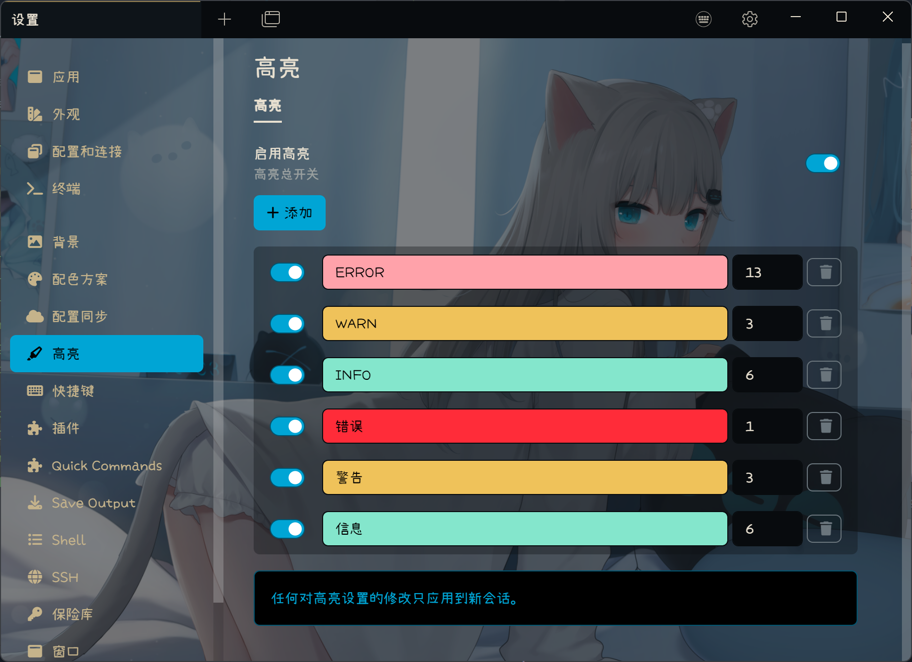

# Tabby Highlight Plugin

Tabby terminal keyword highlight plugin based on Xterm control sequence.

## Features

- Highlight keyword based on Xterm control sequence.
- Support highlight background and foreground color.
- RegExp keywords ready.
- RegExp verification (developing).
- Settings UI support English and Chinese.
- Tested on Windows and MacOS with Tabby version 1.0.204.

## Usage

### Install

To install, use Tabby builtin plugin manager.

### Warning

**Currently the RegExp is not doing verification, invalid RegExp will cause terminal blank.**

## Screenshot

### Settings UI

### Running

## Changelog

- 1.0.5: Support case sensitive switch.
- 1.0.4: Small improvements.
- 1.0.3: Fix bugs.
- 1.0.2: Add RegExp support.
- 1.0.1: Add foreground support.
- 1.0.0: Initial version.
