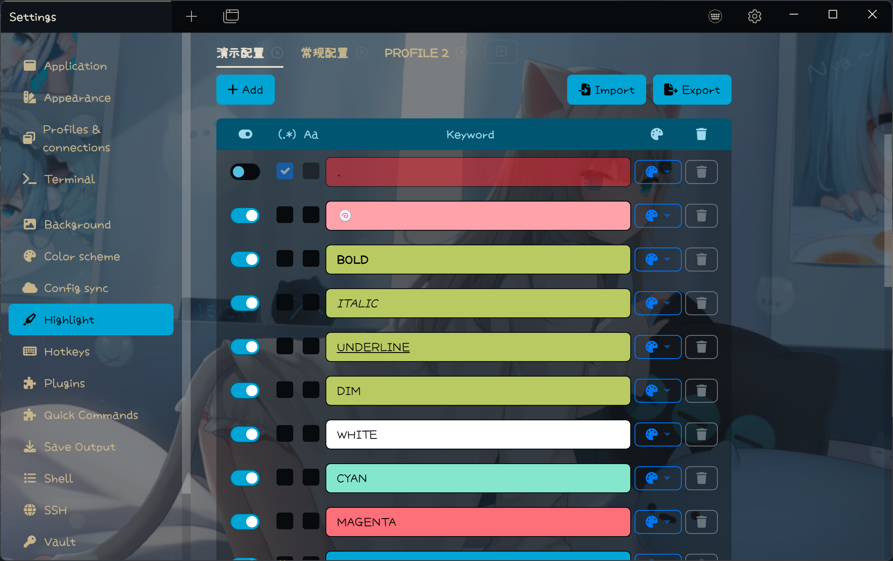
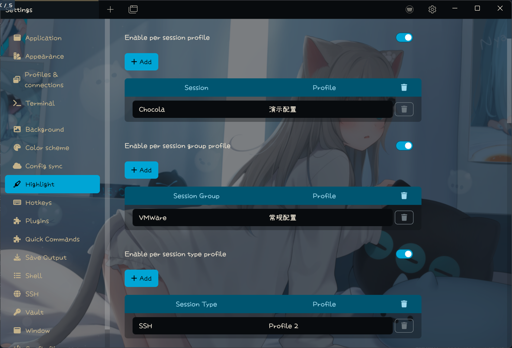
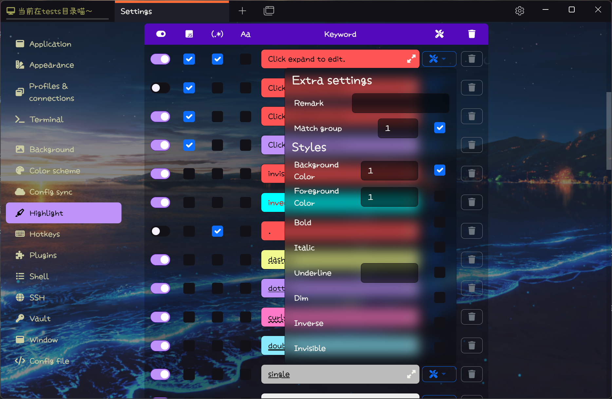
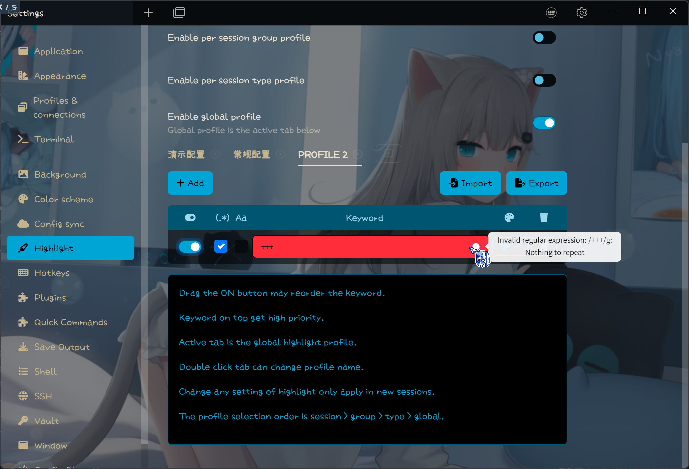
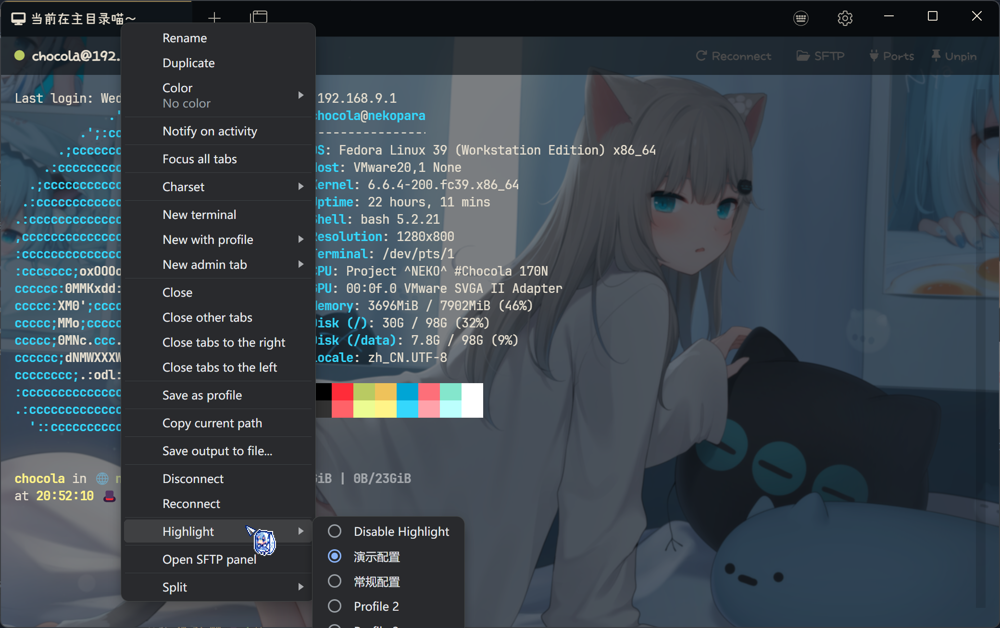
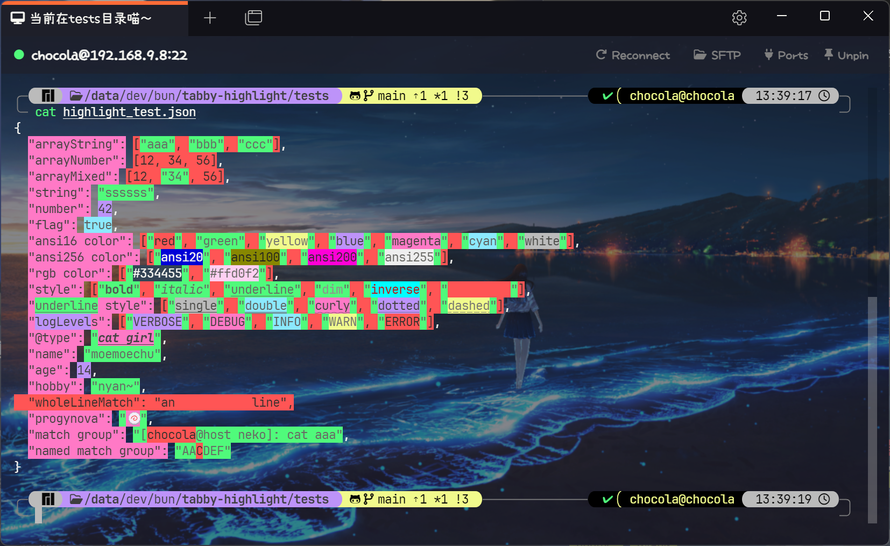
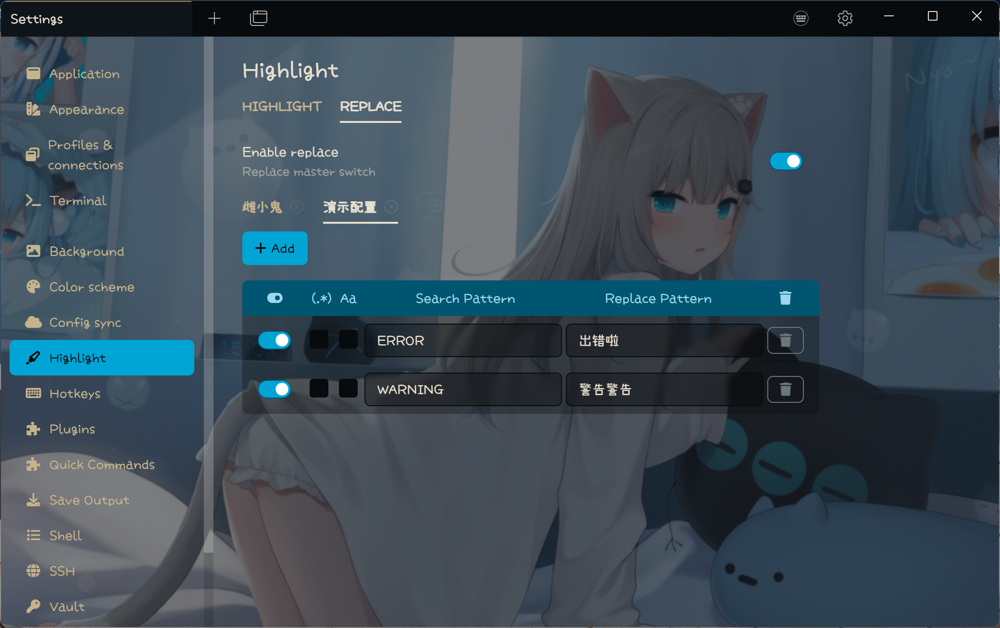
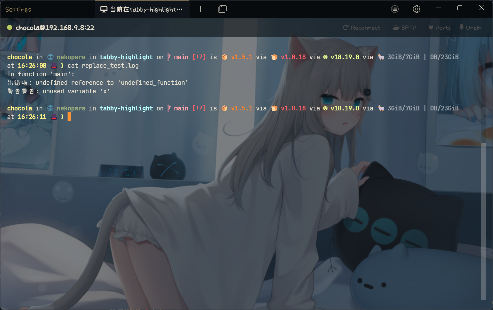
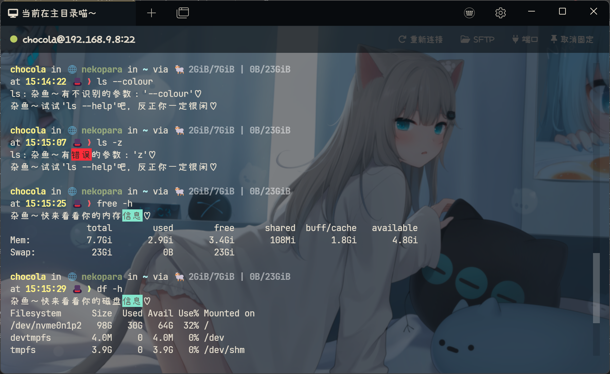

[中文](README.zh-CN.md)

# Tabby Highlight Plugin

Tabby terminal keyword highlight plugin based on Xterm control sequence.

## Features

### Highlight Method

- [x] Highlight keyword based on Xterm control sequence.
- [ ] ~~Highlight keyword based on xterm.js decorator.~~

### Highlight Parameter

- [x] Support highlight background and foreground color.
- [x] Support background and foreground highlight switch separately.
- [x] Support more style (bold, italic, underline).
- [ ] ~~Support true color.~~

### Advanced Feature

- [x] RegExp keywords ready.
- [x] RegExp verification.
- [x] Support RegExp match group(number and named).
- [ ] Support Multi RegExp match group(number and named).
- [ ] Programable(javascript) keyword match.
- [x] Priority adjustment.
- [x] Per keyword case sensitive switch.
- [x] Profile manager.
- [x] Keywords import and export.
- [x] Compatible with white themes.
- [x] Tab context menu fast switch highlight profile.
- [x] Keywords replace(i.e Error:xxx -> 出错啦：xxx)
- [x] Per session/group/type highlight profile.

### Others

- [x] Settings UI support English and Chinese.
- [x] Tested on Windows with Tabby version 1.0.215.

## Usage

### Install

To install, use Tabby builtin plugin manager.

### Reorder

Drag the ON switch will make the keyword draggable.

### Priority

Keyword on top get high priority.

### Per session/group/type Profile

The profile selection order is session > group > type > global.

### Replace

This feature is just for **FUN**, the replace rule only affect content displayed, does not change the real content.

The input string will be proceed from the top pattern to the end pattern.

### **Warning**

**Use carefully with RegExp, complex RegExp will cause performance issue and may make the terminal output in chaos.**

**Be careful when importing external setting files. This plugin does not do vulnerability scanning.**

**There some issue at upgrade 1.0 to 2.0, please clear the plugin config when you upgrade 1.0 to 2.0, fresh install is not affect.**

### Examples

#### Highlight

See [Demo](example_profiles/highlight_demo.json) and [Test case](tests/highlight_test.json).

#### Replace

See [mesugaki](example_profiles/replace_mesugaki.json) and [Test case](tests/replace_test.log)

## Screenshot

### Keyword Setting

### Per Profile Setting

### Keyword Style Setting

### Regexp Verify

### Context Menu

### Highlight Test

### Replace Setting

### Replace Test

## Changelog

- 2.4.0: Add remark.
- 2.3.0: Add Regexp match group support.
- 2.2.0: Add support disable highlight/replace in alternate screen.
- 2.1.0: Support realtime profile changed.
- 2.0.0: Completely refactor.
- 1.7.0: Add tab context menu for fast profile switch.
- 1.6.0: Add replace.
- 1.5.0: Add Per session/group/type Profile.
- 1.4.0: Add profile manager.
- 1.3.0: Add highlight keywords import and export.
- 1.2.5: Refactor match method, now the highlight will work well even if set a keyword regexp **.**(single dot).
- 1.2.4: Compatible with white themes.
- 1.2.3: Support per keyword case sensitive switch.
- 1.2.2: Refactor style setting UI.
- 1.2.1: Support more style (bold, italic, underline).
- 1.2.0: Support Regexp verify.
- 1.1.0: Refactor highlight method, fix nest keyword match, possible downgrade performance(> <).
- 1.0.8: Support keywords priority adjustment.
- 1.0.7: Support background and foreground highlight switch separately.
- 1.0.6: Add error logs.
- 1.0.5: Support case sensitive switch.
- 1.0.4: Small improvements.
- 1.0.3: Fix bugs.
- 1.0.2: Add RegExp support.
- 1.0.1: Add foreground support.
- 1.0.0: Initial version.
