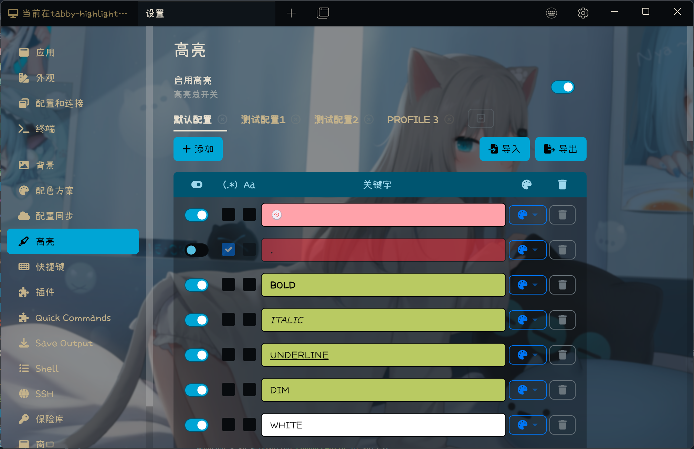
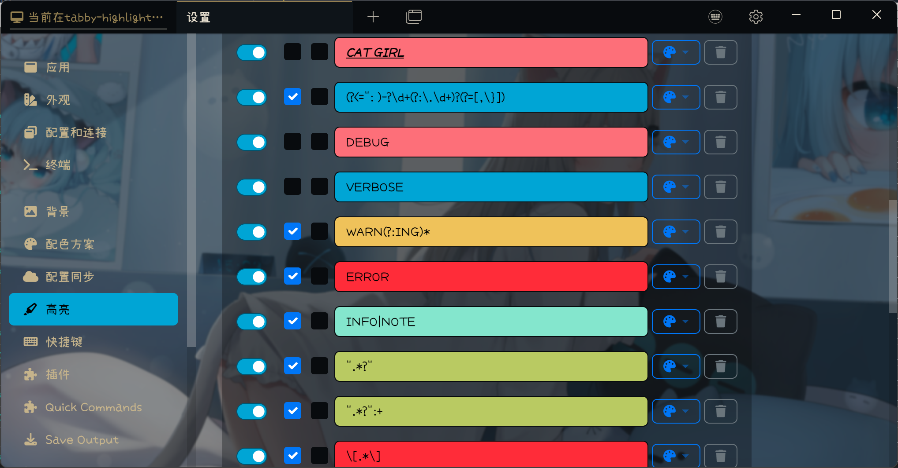
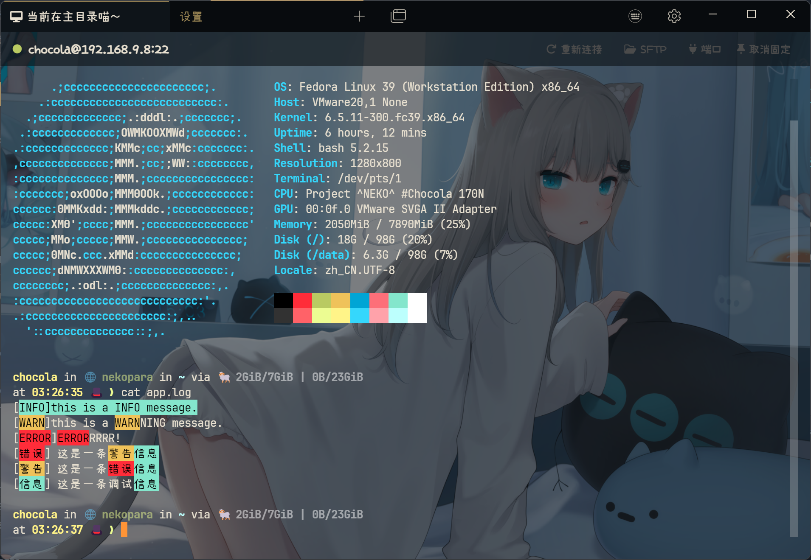
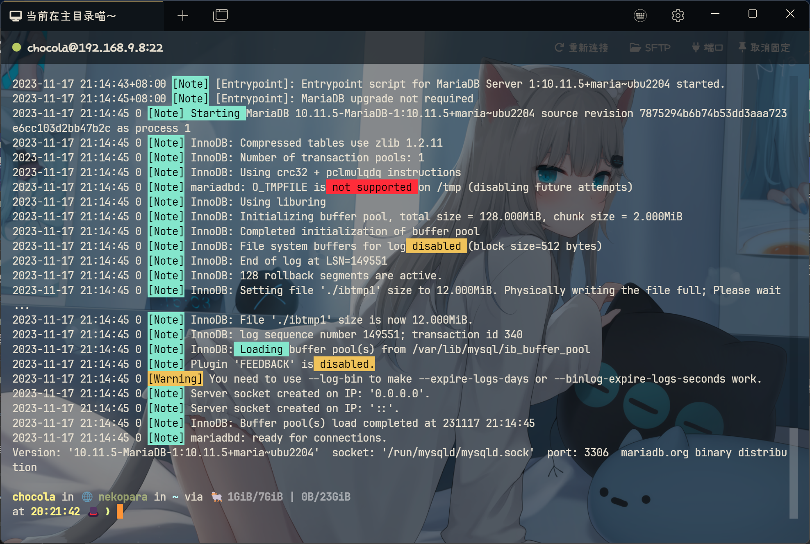
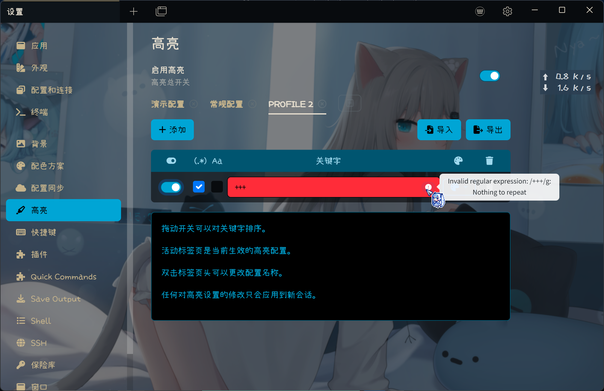

# Tabby Highlight Plugin

Tabby terminal keyword highlight plugin based on Xterm control sequence.

## Features

### Highlight Method

- [x] Highlight keyword based on Xterm control sequence.
- [ ] ~~Highlight keyword based on xterm.js decorator.(太麻烦了，不做了)~~

### Highlight Parameter

- [x] Support highlight background and foreground color.
- [x] Support background and foreground highlight switch separately.
- [x] Support more style (bold, italic, underline).
- [ ] ~~Support true color.(没什么必要，不做了)~~

### Advanced Feature

- [x] RegExp keywords ready.
- [x] RegExp verification.
- [ ] ~~Select the specified RegExp match group.(没什么必要，不做了)~~
- [ ] ~~Programable(javascript) keyword match.(感觉会有安全问题，不做了)~~
- [x] Priority adjustment.
- [x] Per keyword case sensitive switch.
- [x] Profile manager.
- [x] Keywords import and export.
- [x] Compatible with white themes.
- [ ] Tab context menu fast switch highlight profile.
- [ ] Keywords replace(i.e Error:xxx -> 杂鱼 ♥ 出错啦：xxx)
- [ ] Per session highlight profile.
- [ ] Per session group highlight profile.

### Others

- [x] Settings UI support English and Chinese.
- [x] Tested on Windows and MacOS with Tabby version 1.0.205.

## Usage

### Install

To install, use Tabby builtin plugin manager.

### Reorder

Drag the ON switch will make the keyword draggable.

### Priority

Keyword on top get high priority.

### **Warning**

**Use carefully with RegExp, complex RegExp will cause performance issue and may make the terminal output in chaos.**

**Be careful when importing external setting files. This plugin does not do vulnerability scanning.**

## Screenshot

### Settings UI

### Running

### Regexp Verify

## Changelog

- 1.4.0: Add profile manager.
- 1.3.0: Add highlight keywords import and export.
- 1.2.5: Refactor match method, now the highlight will work well even if set a keyword regexp **.**(single dot).
- 1.2.4: Compatible with white themes.
- 1.2.3: Support per keyword case sensitive switch.
- 1.2.2: Refactor style setting UI.
- 1.2.1: Support more style (bold, italic, underline).
- 1.2.0: Support Regexp verify.
- 1.1.0: Refactor highlight method, fix nest keyword match, possible downgrade performance(> <).
- 1.0.8: Support keywords priority adjustment.
- 1.0.7: Support background and foreground highlight switch separately.
- 1.0.6: Add error logs.
- 1.0.5: Support case sensitive switch.
- 1.0.4: Small improvements.
- 1.0.3: Fix bugs.
- 1.0.2: Add RegExp support.
- 1.0.1: Add foreground support.
- 1.0.0: Initial version.
