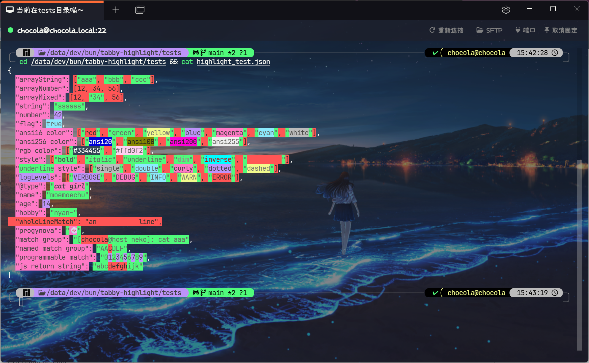

[中文](README.zh-CN.md)

[](https://www.npmjs.com/package/tabby-highlight)

# Tabby Highlight Plugin

Tabby terminal keyword highlight plugin, support text, regexp, javascript

## Features

### Highlight

- [x] Support highlight background and foreground color.
- [x] Support extra styles.
- [x] Support true color(24bit RGB).
- [x] Support regular expression keywords match.
- [x] Support regular expression match group.
- [x] Support programmable(javascript) highlight.
- [x] Support priority adjustment.
- [x] Support profile manager.
- [x] Support profile import and export.
- [x] Support tab context menu fast switch highlight profile.
- [x] Support per session/group/type highlight profile.

### Supported Extra Styles

- [x] **Bold**
- [x] _Italic_
- [x] <span style="text-decoration:underline; text-decoration-style:solid">Underline(Single)</span>
- [x] <span style="text-decoration:underline; text-decoration-style:double">Underline(Double)</span>
- [x] <span style="text-decoration:underline; text-decoration-style:wavy">Underline(Curly)</span>
- [x] <span style="text-decoration:underline; text-decoration-style:dotted">Underline(Dotted)</span>
- [x] <span style="text-decoration:underline; text-decoration-style:dashed">Underline(Dashed)</span>
- [x] Dim
- [x] Inverse
- [x] Invisible

### Replace

- [x] Support keywords replace(i.e Error:xxx -> 出错啦：xxx)
- [x] Support programmable(javascript) replace.

## Usage

### Install

To install, use Tabby builtin plugin manager.

### Highlight Color

This plugin support 4 way to set highlight color

1. Use number 0-15 for ANSI16 color (managed by tabby theme)
2. Use number 16-256 for ANSI256 color ([xterm.js builtin](https://github.com/xtermjs/xterm.js/blob/4c0cf27cfc0205df624452f9657a4acaa3276a19/src/browser/Types.ts#L205))
3. Use css color name like red, green, cyan etc. ([Reference](https://developer.mozilla.org/en-US/docs/Web/CSS/named-color))
4. Use css hex-color #RRGGBB style. ([Reference](https://developer.mozilla.org/en-US/docs/Web/CSS/hex-color))

### Reorder & Priority

Drag the ON switch will make the keyword draggable. Keyword on top get high priority.

### Per session/group/type Profile

The profile selection order is session > group > type > global.

### Programmable highlight

#### Usage

Enable JS switch at keyword setting

js code must be in a function like this

```js
// sync function only
function highlight(input) {
  // your logic
  // you can use lodash by using variable _
  _.forEach(input, (char) => {
    console.log(char);
  });
  return; // return nothing means do not highlight anything
}
```

the function must return positions or string you want to highlight

positions is a array of number or [number, number]

it hold the character position will be highlight, start from 0

i.e:

`[2, 4, 6, 8]` means character at position 2, 4, 6, 8 will be highlight

`[[3, 7], [10, 15]]` means character at position from 3 to 7 and from 10 to 15 will be highlight

#### Example

More example please see plugin builtin template

```js
// highlight odd number
function highlight(input) {
  if (!input.includes("programmable match")) {
    return;
  }
  const pos = [];
  for (i = 0; i < input.length; i++) {
    const num = parseInt(input[i]);
    if (!isNaN(num) && num % 2 != 0) {
      pos.push(i);
    }
  }
  return pos;
}
```

```js
// highlight substring
function highlight(input) {
  if (!input.includes("js return string")) {
    return;
  }
  const r = input.match(/".*?": "(.*?)"/);
  return r[1].slice(3, 8);
}
```

```js
// return a regexp, regexp switch must be checked
function highlight(input) {
  if (!input.includes("js return string")) {
    return;
  }
  return `".*?": "(.*?)"`;
}
```

### Replace

This feature is just for **FUN**, the replace rule only affect content displayed, does not change the real content.

The input string will be proceed from the top pattern to the end pattern.

### **Warning**

**Use carefully with RegExp/JS, complex RegExp/JS will cause performance issue and may lead the terminal output in chaos.**

**Be careful when importing external setting files. This plugin does not do vulnerability scanning.**

### Examples

#### Highlight

See [Demo](example_profiles/highlight_demo.json) and [Test case](tests/highlight_test.json).

#### Replace

See [mesugaki](example_profiles/replace_mesugaki.json) and [Test case](tests/replace_test.log)

## Screenshot

### Keyword Setting


### Per Profile Setting


### Keyword Style Setting


### Regexp Verify


### Code editor and Template


### Context Menu


### Highlight Test



### Replace Setting


### Replace Test


## Plan

- [ ] Refactor the setting UI.
- [ ] Add color picker.
- [x] Programmable(javascript) keyword match.
- [x] Programmable(javascript) replace.
- [ ] LSP Support (in dream)

## Changelog

- 3.0.0: Support programmable(javascript) highlight and replace.
- 2.6.0: Support all 5 underline styles, inverse and invisible style.
- 2.5.0: Support true color(RGB).
- 2.4.0: Add remark.
- 2.3.0: Add Regexp match group support.
- 2.2.0: Add support disable highlight/replace in alternate screen.
- 2.1.0: Support realtime profile changed.
- 2.0.0: Completely refactor.
- 1.7.0: Add tab context menu for fast profile switch.
- 1.6.0: Add replace.
- 1.5.0: Add Per session/group/type Profile.
- 1.4.0: Add profile manager.
- 1.3.0: Add highlight keywords import and export.
- 1.2.5: Refactor match method, now the highlight will work well even if set a keyword regexp **.**(single dot).
- 1.2.4: Compatible with white themes.
- 1.2.3: Support per keyword case sensitive switch.
- 1.2.2: Refactor style setting UI.
- 1.2.1: Support more style (bold, italic, underline).
- 1.2.0: Support Regexp verify.
- 1.1.0: Refactor highlight method, fix nest keyword match, possible downgrade performance(> <).
- 1.0.8: Support keywords priority adjustment.
- 1.0.7: Support background and foreground highlight switch separately.
- 1.0.6: Add error logs.
- 1.0.5: Support case sensitive switch.
- 1.0.4: Small improvements.
- 1.0.3: Fix bugs.
- 1.0.2: Add RegExp support.
- 1.0.1: Add foreground support.
- 1.0.0: Initial version.
