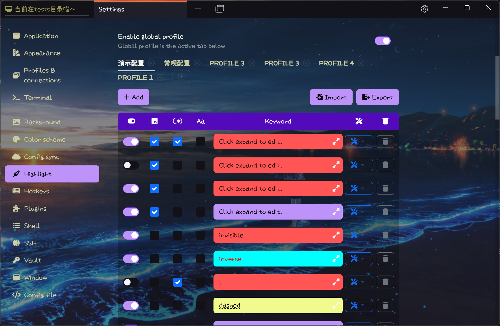
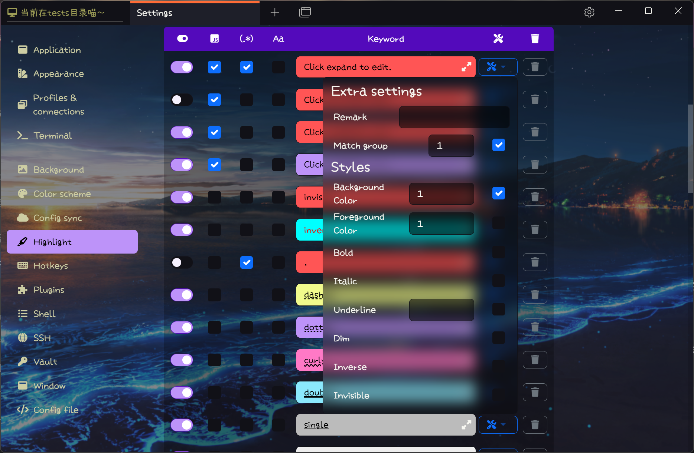
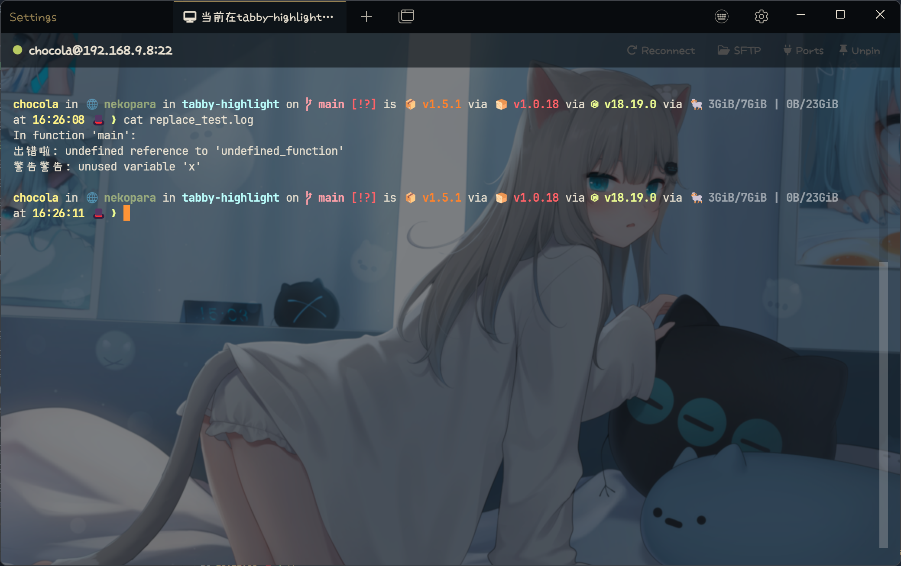

# Tabby 高亮插件

基于 Xterm 控制序列的 Tabby 高亮插件

## 特性

### 高亮

- [x] 支持高亮背景色和前景色
- [x] 支持额外的样式
- [x] 支持24位真彩色
- [x] 支持正则表达式匹配
- [x] 支持正则表达式匹配组
- [x] 支持优先级调整
- [x] 支持方案管理
- [x] 支持方案导入导出
- [x] 支持标签页右键菜单切换高亮方案
- [x] 支持单 会话/组/会话类型 高亮方案

### 支持的额外样式

- [x] **加粗**
- [x] _斜体_
- [x] 下划线(单)
- [x] 下划线(双)
- [x] 下划线(波浪)
- [x] 下划线(点阵)
- [x] 下划线(短划线)
- [x] 变暗
- [x] 反色
- [x] 不可见

### 替换

- [x] 支持关键字替换(i.e Error:xxx -> 出错啦：xxx)

## 使用方法

### 安装

使用 Tabby 自带的插件管理器安装（【设置】→【插件】→ 搜索 Highlight）

### 颜色

本插件支持4种色彩模式

1. 使用0-15表示ANSI标准16色 (由Tabby主题控制)
2. 使用16-256的数字表示ANSI标准256色([xterm.js内置](https://github.com/xtermjs/xterm.js/blob/4c0cf27cfc0205df624452f9657a4acaa3276a19/src/browser/Types.ts#L205))
3. 使用css命名色彩，如red, green, cyan 等等 ([参考](https://developer.mozilla.org/en-US/docs/Web/CSS/named-color))
4. 使用css十六进制色彩#RRGGBB ([参考](https://developer.mozilla.org/en-US/docs/Web/CSS/hex-color))

### 排序

拖动关键字的开关可以排序关键字

### 优先级

最上面的关键字优先级最高

### 单 会话/会话分组/会话类型 方案

方案的选择顺序是 会话 > 会话分组 > 会话类型 > 全局

### 替换

这个功能只是为了 **好玩**，替换只影响显示效果，不影响终端内部实际的内容
终端显示的每一行将按规则从上往下依次替换

### **警告**

**请小心使用正则表达式，复杂的正则表达式可能会带来性能问题，或者会让终端输出变得混乱**

**请小心导入外部配置文件，本插件不做病毒和漏洞扫描**

### 栗子

#### 高亮

参见 [演示](example_profiles/highlight_demo.json) 和 [测试用例](tests/highlight_test.json).

#### 替换

参见 [磁小轨](example_profiles/replace_mesugaki.json) 和 [测试用例](tests/replace_test.log)

## 截图

### 关键字设置

### 单\* 方案设置

### 关键字样式设置

### 正则验证

### 上下文菜单

### 高亮效果测试

### 替换设置

### 替换效果测试

