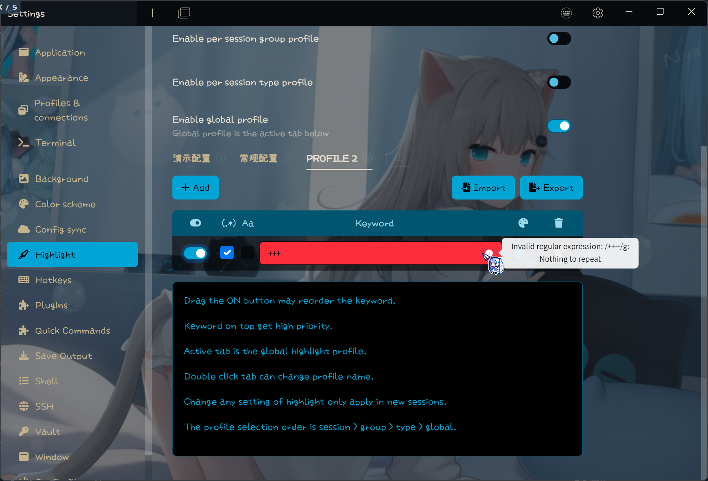
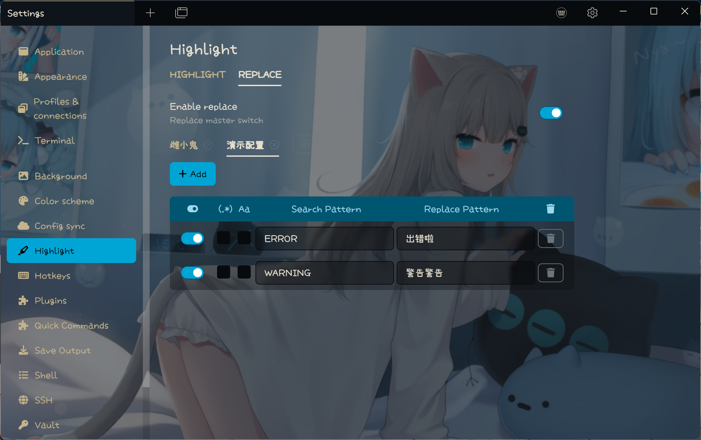

# Tabby 高亮插件

基于 Xterm 控制序列的 Tabby 高亮插件

## 特性

### 高亮方式

- [x] 基于 Xterm 控制序列高亮

### 高亮参数

- [x] 支持设置高亮前景色和背景色
- [x] 支持前景色和背景色分开设置
- [x] 支持多种样式（加粗、斜体、下划线）

### 高级特性

- [x] 支持正则表达式
- [x] 支持正则表达式验证
- [x] 支持匹配组（序号和命名）
- [x] 支持调整关键字优先级
- [x] 支持单个关键字设置大小写敏感
- [x] 支持方案管理
- [x] 支持导入导出方案
- [x] 兼容白色主题
- [x] 支持终端标签页右键切换方案
- [x] 支持关键字替换功能（例如：Error:xxx -> 出错啦：xxx）
- [x] 支持按单会话/会话分组/会话类型设置高亮方案

### 其他

- [x] 设置界面支持中文和英文
- [x] 在 Windows 下使用 Tabby 1.0.215 测试通过

## 使用方法

### 安装

使用 Tabby 自带的插件管理器安装（【设置】→【插件】→ 搜索 Highlight）

### 排序

拖动关键字的开关可以排序关键字

### 优先级

最上面的关键字优先级最高

### 单 会话/会话分组/会话类型 方案

方案的选择顺序是 会话 > 会话分组 > 会话类型 > 全局

### 替换

这个功能只是为了 **好玩**，替换只影响显示效果，不影响终端内部实际的内容
终端显示的每一行将按规则从上往下依次替换

### **警告**

**请小心使用正则表达式，复杂的正则表达式可能会带来性能问题，或者会让终端输出变得混乱**

**请小心导入外部配置文件，本插件不做病毒和漏洞扫描**

**从1.0升级到2.0会有一些问题，如果从1.0升级到2.0，需要将插件配置清除，如果是全新安装则不影响**

### 栗子

#### 高亮

参见 [演示](example_profiles/highlight_demo.json) 和 [测试用例](tests/highlight_test.json).

#### 替换

参见 [磁小轨](example_profiles/replace_mesugaki.json) 和 [测试用例](tests/replace_test.log)

## 截图

### 关键字设置

### 单\* 方案设置

### 关键字样式设置

### 正则验证

### 上下文菜单

### 高亮效果测试

### 替换设置

### 替换效果测试

